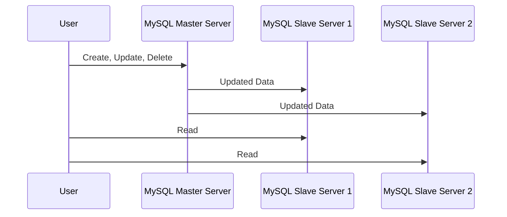
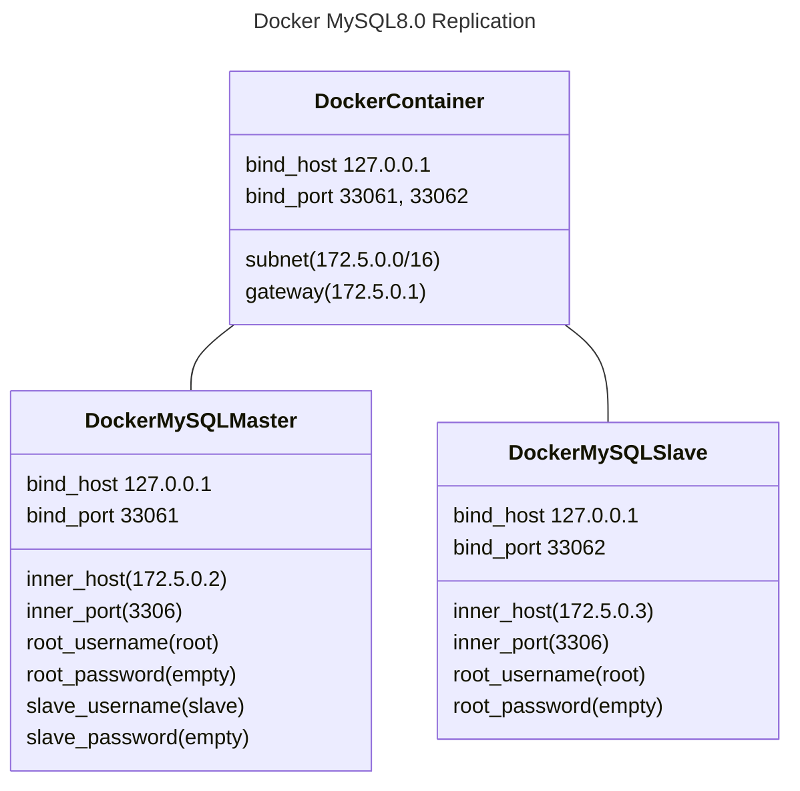

# 들어가며

현재 회사에서는 Replication을 사용하지 않고, 단일 커넥션 풀로 관리하고 있다. 그러다보니, 동시 많은 요청이 들어오면(실제로 그리 많지도 않고, 약 100건 정도의 동시 요청이다) 데이터 조회 API 요청 시 응답 속도가 느려지는 이슈가 발생한다. 이를 해결하기 위해 DB 분산 처리에 대한 내용을 검색해 보던 중 MySQL Replication을 알게되었다. 이에 대해 공부하고 NestJS에 적용시켜 본 내용을 정리하여 작성하였다.

# 1. 개요

Replication은 복제를 의미하며, DBMS를 2대 이상으로 나누어 데이터를 저장하는 방식을 뜻한다. 이를 통해 실시간 Data 백업과 여러 대의 DB 분산 처리를 할 수 있다. 자세히 설명하기 전에 구조 먼저 알아보자.

## 1.1. 기본 구성

기본적으로 Master / Slave로 구성된다. Master DBMS는 웹 서버가 데이터 CRUD 요청 시 bin 로그(Binary Log)를 생성하여 Slave로 전달하며, 주로 CUD 작업을 한다. Slave DBMS는 Master DBMS로부터 전달받은 bin log를 데이터로 반영하며, 주로 R 작업을 한다.



## 1.2. 실시간 데이터 백업

Master 서버를 데이터 원본 서버, Slave 서버를 복제(백업) 서버라고 하겠다. Master서버의 DBMS에 CUD가 발생하면 Slave 서버에 변경된 데이터를 전달한다. 이는 원본 서버를 복제 서버로 백업하는 과정이라고도 할 수 있으며, Master 서버에 장애가 발생하는 경우 Slave 서버로 변경하여 서비스를 임시적으로 운영할 수 있다.

## 1.3. DBMS의 부하 분산

1대의 DB 서버로 트래픽을 감당할 수 없을 때, Slave Server를 여러대 두어 부하를 분산시킬 수 있다.

> 위의 차트는 CUD 요청에 비해 R 요청이 많은 경우에 해당한다. R 요청만 분산시키더라도 DBMS가 더 많은 CUD를 처리할 수 있다.

# 2. 실습

먼저, MySQL Replication을 사용하는 경우 주의해야 할 사항은 다음과 같다.

- Replication을 사용하는 MySQL의 버전과 동일하게 맞추는 것이 좋다.
- Replication을 사용하는 MySQL의 버전이 서로 다른 경우 Slave가 상위 버전이어야 한다.
- Replication을 가동할 때에는 Master, Slave 순으로 서버를 가동시켜야 한다.

실습은 Docker로 Master, Slave MySQL(8.0 버전)을 실행하고, NestJS에서 커넥션을 분리하는 방식으로 진행하였다.

## 2.1. Docker 실행

먼저, 아래 링크의 소스코드를 clone하자.

> Docker 설치 방법에 대해서는 별도로 다루지 않겠다. 아, 참고로 필자는 MacBook(M2)으로 진행했다.

- https://github.com/choewy/mysql-80-replication-docker

mysql 폴더 안에 docker-compose.yaml 파일을 보면 알 수 있겠지만, 이를 도식화해보면 다음과 같다(README.md에도 작성해놓았다).



비밀번호는 설정하지 않았다. 비밀번호를 설정하려면 docker-compose.yaml 파일의 environment를 다음과 같이 수정하면 된다.

```yaml
services:
  mysql-master:
    # ...중략...
    environment:
      MYSQL_ROOT_PASSWORD: master_password

  mysql-slave:
    # ...중략...
    environment:
      MYSQL_ROOT_PASSWORD: slave_password
```

docker-compose.yaml 파일이 위치하는 폴더로 터미널을 열고, 아래 명렁어를 실행하여 Docker Conatiner를 실행한다.

```zsh
docker-compose up --build -d
```

## 2.2. Master 서버 설정

Docker 컨테이너가 실행될 때 Master DBMS에 아래 쿼리가 실행되도록 설정해놓았다.

- master.sql

```sql
-- DB 생성
CREATE DATABASE IF NOT EXISTS `local`;

-- 계정 생성 및 권한 부여
CREATE USER 'master'@'%' IDENTIFIED BY 'master_password';
GRANT ALL PRIVILEGES ON `local`.* TO 'master'@'%';

-- Replication 계정 생성
CREATE USER 'repl'@'%';
GRANT REPLICATION SLAVE ON *.* TO 'repl'@'%';

FLUSH PRIVILEGES;
```

## 2.3. Slave 서버 설정

마찬가지로 Docker 컨테이너가 실행될 때 Slave DBMS에 아래 쿼리가 실행되도록 설정해놓았다.

> 필자가 작성한 Docker의 Master DBMS가 최초 실행될 때 Log File은 mysql-bin.000003, Log Position은 157이었으므로, 쿼리문에 해당 데이터를 하드코딩하였다.

```sql
-- DB 생성
CREATE DATABASE IF NOT EXISTS `local`;

-- 계정 생성 및 권한 부여
CREATE USER 'slave'@'%' IDENTIFIED BY 'slave_password';
GRANT ALL PRIVILEGES ON `local`.* TO 'slave'@'%';

FLUSH PRIVILEGES;

-- Replica 설정
CHANGE REPLICATION SOURCE TO
  SOURCE_HOST='172.5.0.2',
  SOURCE_LOG_FILE='mysql-bin.000003',
  SOURCE_LOG_POS=157;

-- Replica 실행
START REPLICA USER='repl' PASSWORD='';
```

## 2.4. Slave 서버 Replica 실행

Docker 컨테이너가 동작할 때 Replica도 실행하도록 쿼리문을 작성하였지만, 실제로 Slave DBMS에 아래 쿼리를 날려보았을 때 Replica가 동작하지 않음을 확인하였다.

```sql
SHOW REPLICA STATUS;
```

```json
{
  "Replica_IO_State": "",
  "Replica_IO_Running": "No",
  "Replica_SQL_Running": "No"
}
```

따라서, 직접 Replication Source를 수정 후 Replica를 실행시켜주었다. 이때, Replica를 수동으로 실행하려는 동안 Master DBMS에 bin log 파일 또는 위치가 변경될 수 있으니, 먼저 Master DBMS에서 Log File과 Log Position 정보를 조회 후 해당 데이터를 반영시켜주도록 하자.

```sql
-- mysql(master, 172.5.0.2:33061)

SHOW MASTER STATUS;
```

```json
{
  "File": "mysql-bin.000003",
  "Position": 896997
}
```

```sql
-- mysql(slave, 172.5.0.3:33062)

CHANGE REPLICATION SOURCE TO
  SOURCE_HOST='172.5.0.2',
  SOURCE_LOG_FILE='mysql-bin.000003',
  SOURCE_LOG_POS=896997;

START REPLICA USER='repl' PASSWORD='';
```

다시 아래 쿼리문으로 확인해보면 Replica가 정상 동작(Master 서버로부터 이벤트 수신 대기)하는 것을 확인할 수 있다.

```sql
-- mysql(slave, 172.5.0.3:33062)

SHOW REPLICA STATUS;
```

```json
{
  "Replica_IO_State": "Waiting for source to send event",
  "Replica_IO_Running": "Yes",
  "Replica_SQL_Running": "Yes"
}
```

## 2.5. Replica 테스트

테스트해보기 위해 Master DBMS에 test라는 DB를 생성해보자. 우리가 기대하는 결과는 Slave DBMS에도 test라는 DB가 생성되어야 하는 것이다.

```sql
-- mysql(master, 172.5.0.2:33061)

CREATE DATEBASE `test`;
```

이제 Slave DBMS에 아래 쿼리를 실행하여 확인해보면 Slave DBMS에도 test DB가 생성된 것을 확인할 수 있다.

```sql
-- mysql(slave, 172.5.0.3:33062)

SHOW DATABASES;
```

```json
{
  "Database": [
    "sys",
    "mysql",
    "information_schema",
    "performance_schema",
    "local",
    "test"
  ]
}
```

# 마치며

여기까지 Docker로 MySQL Replication을 직접 구성해보고, 실행한 내용을 기록하였다. 다음에는 여기에서 구성한 내용을 활용하여 NestJS에서의 TypeORM을 통한 Multi Connection에 대해 기록하겠다.
