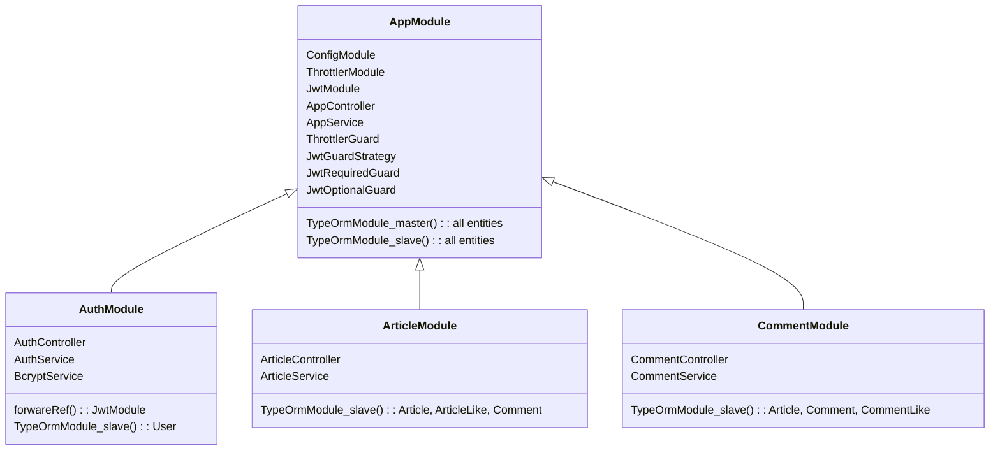
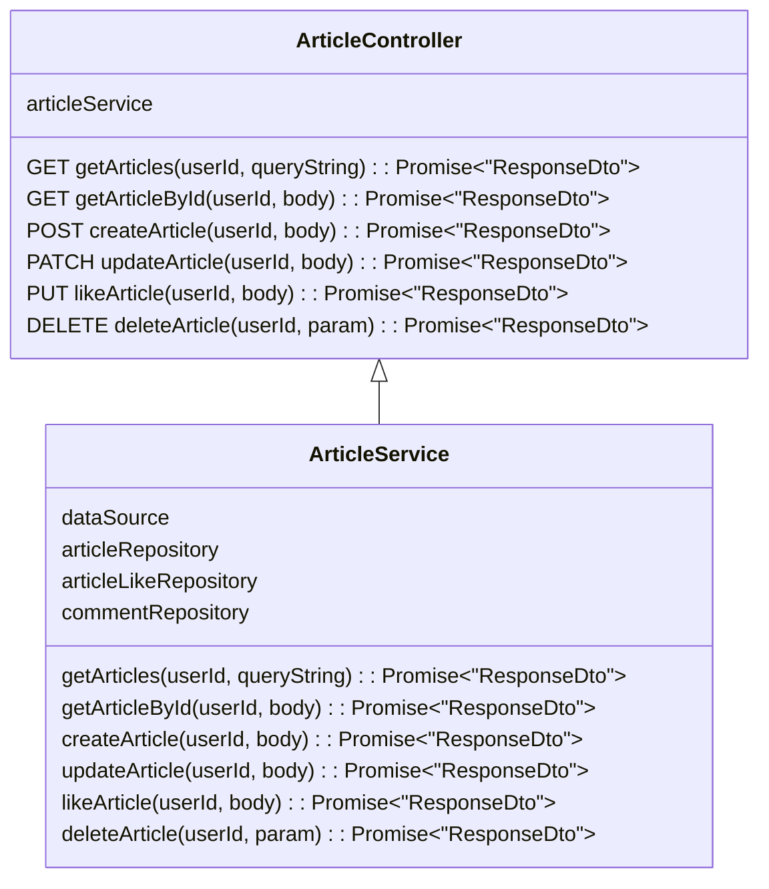

# 들어가며

[지난글](https://choewy.tistory.com/154)에 이어서 이번에는 MySQL Replication을 통해 NestJS TypeORM에서 Multi Connection으로 관리하는 방법에 대해서 정리해보겠다.

# 1. 개요

실습 주제는 간단한 게시판 API 서버이며, 모듈 구조는 다음과 같다.



기능은 회원가입, 로그인, 게시글 CRUD, 댓글 CRUD, 게시글/댓글 좋아요 정도가 되겠다. 인증은 passport jwt를 확장한 JwtGuard(Required, Optional)을 사용하였고, ThrottlerGuard를 통해 무지성 API 호출에 대한 방어를 하였다.

# 2. 실습

이제부터 본격적으로 실습을 해보자. 가장 먼저 NestJS 프로젝트를 생성하고 관련된 의존성을 설치해주자.

> NestJS 공식문서 및 자세한 내용(의존성이라던가 소스코드 등)은 [Github(mysql-replication)](https://github.com/choewy/mysql-replication)에 올려놓았으므로 별도로 설명하지 않겠다. 궁금하신 분들은 참고하시길...

## 2.1. TypeOrmModuleOptions

TypeOrmModule의 옵션 중에서 `name`이라는 proeperty가 있다. 기본값은 `default`로 입력되며, 두 개 이상의 커넥션을 생성할 때에는 해당 값에 별칭을 입력해주어야 한다. 필자는 Master DBMS에 연결할 커넥션 옵션의 `name`은 `default`, Slave DBMS에 연결할 커넥션 옵션의 `name`은 `slave`로 하였다.

```ts
/** @path src/core/constants/enums.ts */

export enum DatabaseType {
  MASTER = 'default',
  SLAVE = 'slave',
}
```

> Github에 `.env`파일까지 올려놓았으니, DB 연결 정보는 해당 파일에서 확인하면 된다.

그리고 AppModule에 아래와 같이 주입해주었다.

```ts
/** @path src/app.module.ts */

@Module({
  imports: [
    ConfigModule.forRoot(),
    TypeOrmModule.forRoot(
      new DatabaseConfig('MASTER').getTypeOrmModuleOptions(entityTargets),
    ),
    TypeOrmModule.forRoot(
      new DatabaseConfig('SLAVE').getTypeOrmModuleOptions(
        entityTargets,
        DatabaseType.SLAVE,
      ),
    ),
  ],
})
export class AppModule {}
```

> entityTargets는 Entity Schema 객체만 담긴 Array이다.

## 2.2. InjectSlaveRepository

본 프로젝트에서의 Master Connection는 CUD, Slave Connection는 R 기능만 사용할 것이다. Master Connection은 Service에 DataSource를 직접 주입해서 DataSource를 통해 필요한 Repository를 가져오거나, Transaction을 처리할 것이고, Slave Connection은 Service에 필요한 Repository를 직접 주입하여 사용할 것이다. 후자의 경우 TypeOrm에서 제공하는 InjectRepository 데코레이터를 사용하면 되는데, 두 번째 인자에 `slave`라고 명시해주어야 하는 번거로움이 있다. 따라서, 커스텀 데코레이터를 생성하여 이를 사용해주도록 하겠다.

```ts
/** @path src/common/decorators/repository.derorator.ts */

import { Type } from '@nestjs/common';
import { InjectRepository } from '@nestjs/typeorm';

import { DatabaseType } from '@core/constants';

export const InjectSlaveRepository = (entity: Type<any>) =>
  InjectRepository(entity, DatabaseType.SLAVE);
```

## 2.3. Query 객체를 사용한 DB 요청

앞서 언급하였듯이 3개의 모듈만 구현하면 된다. 3개의 모듈 내부 구조가 거의 비슷하므로 이중에서 ArticleModule에 대해서만 기록하도록 하겠다.



위의 차트를 보면 알 수 있듯이 ArticleModule에는 ArticleController와 ArticleService가 주입되어 있다. Controller는 요청을 받고 응답하는 부분이고, 실제 비즈니스 로직은 Service에서 수행하므로 Controller는 최대한 간소하게 코드를 작성하였다.

> 이 말인 즉슨, Controller 코드는 볼 필요가 없고, 이 글에서도 설명하지 않겠다는 말이올시다...

이제 ArticleService의 내부를 뜯어보자. Service 코드를 뜯어보면 알 수 있지만, 실제 Repository이든, DataSource로 뽑아온 Repositorty이든 상관없이 Query 객체로 넘겨서 DB에게 요청하는 것을 확인할 수 있다.

```ts
/** @path src/common/queries/article.query.ts */

export class ArticleQuery {
  constructor(private readonly repo: Repository<Article>) {}

  async findArticlesAndCount(skip = 0, take = 10) {
    return this.repo.findAndCount({
      relations: { user: true },
      select: {
        id: true,
        title: true,
        content: true,
        createdAt: true,
        updatedAt: true,
        user: { id: true, email: true, nickname: true },
      },
      order: { createdAt: 'DESC' },
      skip,
      take,
    });
  }

  async saveArticle(article: Article) {
    return this.repo.save(article);
  }

  async deleteArticle(id: number) {
    return this.repo.softDelete(id);
  }
}
```

왜 이렇게 구성했는가? 개인 취향이다. 물론 100% 개인 취향은 아니고, 나름 확장성을 고려해서 위와 같은 구조를 채택하였다. Repository에서 직접 메소드를 호출해도 되지만, QueryBuilder를 사용하면 Service의 method 코드가 길어지는 탓에 가독성이 떨어진다고 느꼈다. 뿐만 아니라, TypeOrm 3.0 버전부터는 CustomRepository를 지원하지 않으므로 별도의 Query 객체로 관리하도록 하였다.

물론, CustomRepository 데코레이터를 직접 만들어서 관리할 수 있다. 그러나, 이 데코레이터를 만들고 난 후에 아래와 같은 의문이 생겨 별도의 Query 객체로 관리하는 구조를 채택하였다.

> 덩치가 커진 Repository를 굳이 의존성으로 주입해서 생명주기를 늘려야 할 필요가 있는가? 오히려 리소스만 잡아먹는 것처럼 느껴지기도 했다. 해당 데코레이터도 [Github(nestjs-typeorm-injectable-repository)](https://github.com/choewy/nestjs-typeorm-injectable-repository)에 업로드 해놓았으니 궁금하신 분들은 참고하시라...

## 2.4. 성능 테스트

성능을 테스트해보기 위해 NodeJS로 axios요청을 보내는 코드를 작성한 후 프로젝트 서버로 2000번 무작위 요청을 3회 보낸 결과는 다음과 같다.

```json
{
  "1회차": {
    "단일커넥션": {
      "R 평균 처리 시간": "66ms",
      "CUD 평균 처리 시간": "32ms"
    },
    "멀티커넥션": {
      "R 평균 처리 시간": "24ms",
      "CUD 평균 처리 시간": "17ms"
    }
  },
  "2회차": {
    "단일커넥션": {
      "R 평균 처리 시간": "43ms",
      "CUD 평균 처리 시간": "26ms"
    },
    "멀티커넥션": {
      "R 평균 처리 시간": "28ms",
      "CUD 평균 처리 시간": "21ms"
    }
  },
  "3회차": {
    "단일커넥션": {
      "R 평균 처리 시간": "33ms",
      "CUD 평균 처리 시간": "41ms"
    },
    "멀티커넥션": {
      "R 평균 처리 시간": "21ms",
      "CUD 평균 처리 시간": "16ms"
    }
  }
}
```

위의 결과를 보면 알 수 있듯이 두 개의 커넥션이 서로 다른 일을 수행하므로 처리 시간이 비교적 빠르다는 것을 알 수 있다.

> 물론, 테스트는 내 개인 맥북에서 진행했는데, 실제로는 네트워크 상태나 인스턴스 사양에 따라 별차이가 없을 수도 있다.

# 마치며

이번 추석 연휴 동안 알차게 시간을 보낸 것 같다. 정말 뜬금없는 뜬구름 잡는 소리일 수 있으나, 공부하고 코드만 작성하면 먹고 사는데 지장 없을 만큼의 돈이 들어왔으면 좋겠다는 생각이 들곤 한다. 나중에 내가 하고자 하는 서비스 주제가 생긴다면 지금 하고 있는 공부와 다양한 시도가 매우 좋은 밑거름이 되어주리라 확신한다.
