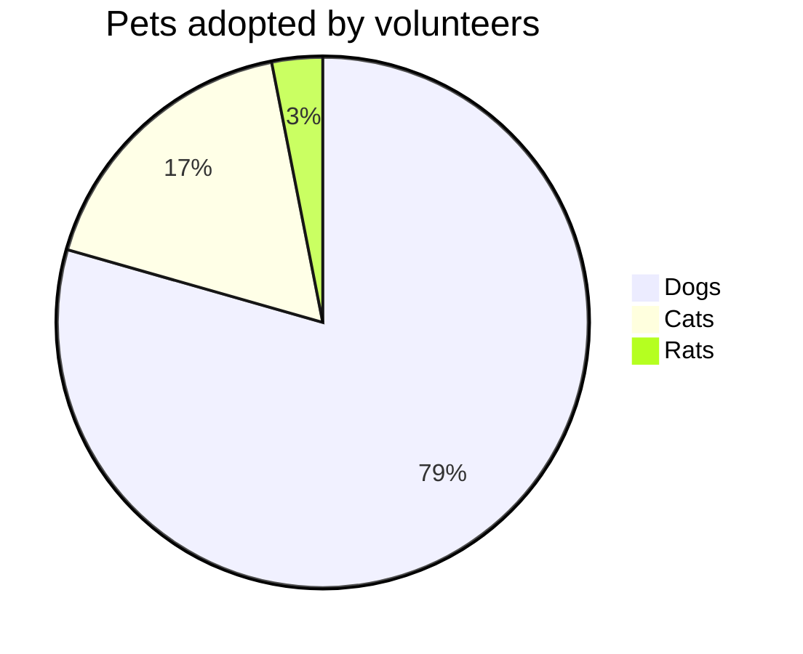

# 들어가며

필자는 주로 Markdown으로 글을 작성한다. 그러던 중 몇개월 전에 Mermaid라는 것을 알게 되었는데, 이를 티스토리에도 적용시키고자 한다.

# 1. 개요

Mermaid는 코드로 차트를 그릴 수 있도록 해주는 오픈소스이다.

> 공식 문서가 매우 친절하게 작성되어 있기에 Mermaid에 대해서 자세히 설명하진 않겠다. 관심 있다면 [Mermaid 링크](https://mermaid.js.org)를 클릭해서 보시라.

Markdown으로 코드를 작성할 때, 다음과 같이 mermaid라는 언어로 지정하면 차트를 그릴 수 있다.

- Markdown에서 작성한 mermaid 코드

````
  ```mermaid
  pie title Pets adopted by volunteers
    "Dogs" : 386
    "Cats" : 85
    "Rats" : 15
  ```
````

- 위의 코드로 나타난 결과



# 2. 설정 방법

## 2.1. 공식 문서에 기재된 내용

대략적인 설명은 이쯤으로 마무리하고, 본론으로 들어가서 티스토리에 Mermaid를 적용하는 방법에 대해 알아보자.

[Github README.md로 작성된 Mermaid 문서](https://github.com/hsuhau/mermaid/tree/main)를 보면 아래와 같이 친절하게 설명되어 있는 것을 볼 수 있다.

To deploy mermaid without a bundler, one can insert a script tag with an absolute address and a mermaidAPI call into the HTML like so:

```js
<script src="https://cdn.jsdelivr.net/npm/mermaid/dist/mermaid.min.js"></script>
<script>mermaid.initialize({startOnLoad:true});</script>
```

Doing so will command the mermaid parser to look for the `<div>` tags with `class="mermaid"`. From these tags mermaid will try to read the diagram/chart definitons and render them into svg charts.

> 마지막 내용을 간단히 요약해보면, div 태그 중에서 class가 mermaid인 요소를 svg로 렌더링한다고 되어있다. 이 내용을 잘 기억하도록 하자.

## 2.2. Mermaid 적용 방법 구상

티스토리의 code block은 pre 태그로 감싸진 code 요소이다. 그리고, code block의 언어를 mermaid로 지정한 경우 class는 language-mermaid로 부여되며, 티스토리의 기본 스타일로 적용된다. 그렇다면, 이 문제를 푸는 방법은 매우 간단하다.

1. code 태그 중에 class가 language-mermaid인 요소 찾는다.
2. 1에서 찾은 요소를 div 태그로 바꾼다.
3. 2에서 바꾼 div 태그의 class를 mermaid로 재설정한다.
4. 그리고, 보기 좋게 가운데 정렬을 해준다.

위의 해결 방법을 Vanilla js와 jQuery로 나타내면 다음과 같다.

> 두 가지 방법을 공유했으니, 기호에 따라 취사 선택 하시라...

- Vanilla js

```js
document.addEventListener('DOMContentLoaded', () => {
  const elements = document.querySelectorAll('code.language-mermaid');

  for (const element of elements) {
    const div = document.createElement('div');
    div.innerHTML = element.textContent;
    div.className = 'mermaid';

    const pre = element.parentElement;
    pre.style.textAlign = 'center';
    pre.removeChild(element);
    pre.appendChild(div);
  }
});
```

- jQuery

```js
$(document).ready(() => {
  const elements = $('code.language-mermaid');

  elements.parent('pre').css('text-align', 'center');
  elements.contents().unwrap().wrap('<div class="mermaid"></div>');
});
```

## 2.3. 티스토리 스킨 편집 HTML에 적용

이제 위의 코드를 티스토리 직접 옮겨보도록 하자. 티스토리 블로그관리에서 스킨편집 페이지로 이동 후 html 편집 버튼을 누른다. 이어서 `<head> ~ </head>` 안에 아래 코드를 고대로 복붙해주자.

- Vanilla js

```html
<script src="https://cdn.jsdelivr.net/npm/mermaid/dist/mermaid.min.js"></script>
<script>
  document.addEventListener('DOMContentLoaded', () => {
    const elements = document.querySelectorAll('code.language-mermaid');

    for (const element of elements) {
      const div = document.createElement('div');
      div.innerHTML = element.textContent;
      div.className = 'mermaid';

      const pre = element.parentElement;
      pre.style.textAlign = 'center';
      pre.removeChild(element);
      pre.appendChild(div);
    }

    mermaid.initialize({ startOnLoad: true });
  });
</script>
```

- jQuery

```html
<!-- 반드시 jQuery import <script> 태그가 아래 코드보다 위에 위치해야 함 -->

<script src="https://cdn.jsdelivr.net/npm/mermaid/dist/mermaid.min.js"></script>
<script>
  $(document).ready(() => {
    const elements = $('code.language-mermaid');

    elements.parent('pre').css('text-align', 'center');
    elements.contents().unwrap().wrap('<div class="mermaid"></div>');

    mermaid.initialize({ startOnLoad: true });
  });
</script>
```

# 마치며

오랜만에 JQuery를 다뤄보니 감회가 새롭고 처음 Javascript를 접할 때의 기억이 새록새록 떠올라서 좋았다. 아무쪼록 이 글 또한 티스토리에 Markdown을 적용하시는 분들께 많은 도음이 되었으면 하는 바람으로 글을 마친다.
