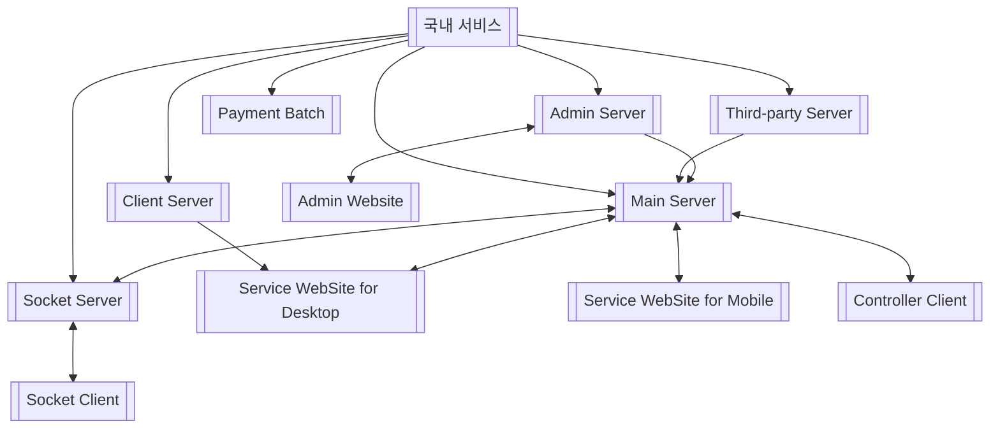
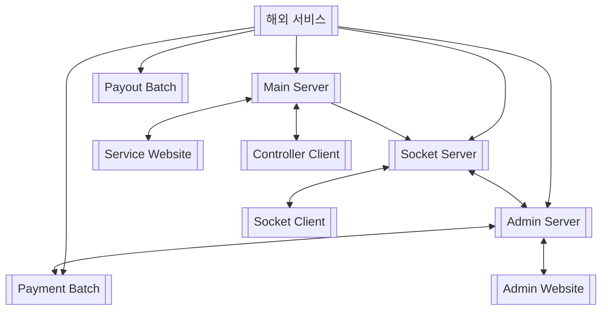
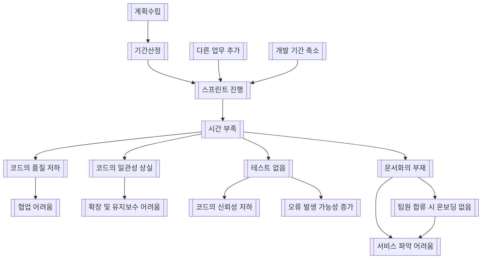
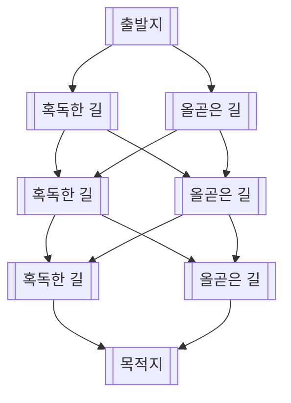

# 들어가며

11월 30일, 개발자로 커리어를 전향한 후 약 1년 3개월 동안 기여해왔던 회사에서 퇴사했다. 그간 많은 일이 있었고 하고픈 말 또한 많지만 삼키느라 애먹었다. 어디서부터 회포를 풀어가야 하는지 고민하면서 수차례 글을 쓰다가 지우고를 반복하였다. 본 글에서는 기승전결(뒤로 갈수록 할 말이 많아질 것이라는 필자의 주관적 의도)로 회사의 간략한 소개, 필자가 해온 일, 아쉬운 점 등에 대해서만 담백하게 다루고 큼지막한 이슈는 또 다른 글로 작성하겠다.

# 1. 서비스 소개

필자가 다니던 곳은 국내 후원 서비스에서 양대 산맥을 이루는 투네이션, 트윕을 뒤로하고 후발주자로 열심히 쫒고 있는 서비스를 운영하고 있다. 서비스 회원가입자 수는 약 5만 명 정도이며, 일간 이용자는 약 150명 정도가 되는 작은 규모의 스타트업이다. 국내 후원 서비스의 낮은 수수료율, 한국이라는 작은 시장 규모를 탈피하기 위하여 올해 6월 말에 해외 서비스를 런칭했다. 해외 서비스 회원가입자 수는 약 2천 명이며, 일간 이용자는 약 15명이나, 국내 보다 월등히 높은 서비스 이용료와 해외 시장에는 없는 시청자 참여라는 콘텐츠로 인해 우상향하는 매출 상승세를 보여주고 있다.

# 2. 기술 스택 및 구성

## 2.1. 기술 스택

회사에서 사용했던(또는, deprecated 상태인) 기술 스택은 다음과 같다.

| 구분       | 항목                                                                                                          |
| ---------- | ------------------------------------------------------------------------------------------------------------- |
| Git        | Bitbucket                                                                                                     |
| CI/CD      | Bitbucket Pipelines                                                                                           |
| Backend    | NestJS, Socket.io, TypeORM, IoRedis, Redlock, PM2                                                             |
| Frontend   | NextJS, ReactJS, Socket.io-client, scss                                                                       |
| IaaS       | Azure(VM, MySQL, Redis, MQ) AWS(EC2, RDS, Codedeploy, ASM, SQS, Elasticache, S3, CloudFront) CloudFlare |
| Motinoring | Grafana, Sentry, Slack Webhook, Mixpanel(deprecated)                                                          |

## 2.2. 서비스 구성

서비스를 구성하고 있는 요소들을 간략히 나열하면 다음과 같으며, 결코 작은 편이 아니라고 생각한다.

서버와 서버 간에는 Message Queue(FIFO), http, Redis Pub/Sub으로 통신하고, 서버와 클라이언트 간에는 http, ws 프로토콜로 통신하도록 구성되어 있다.

# 3. 회상

1년 3개월 간 백엔드, 인프라, 프론트엔드 구분하지 않고 개발을 해왔으며, 모든 일을 작성하다가는 끝이 없을 듯하여 기억에 남는 일들만 추려서 간략하게 작성하였다.

## 3.1. 어드민 서버 개발

처음 입사했을 당시 개발팀은 백엔드 2명(필자 포함), 프론트엔드 3명으로 구성되어 있었다. 서비스 전체 리뉴얼 작업이 마무리중이었으며, 입사 후 1주일 간 파일럿 프로젝트를 진행한 후 별도의 온보딩 과정 없이 어드민 서버 개발 작업에 들어갔다. 어드민 개발은 백엔드 1명(필자), 프론트엔드 2명으로 진행하였으며 필자를 포함하여 모두 항해99 출신 신입 개발자였으며, 약 1개월 간 순조롭게 진행되었다.

## 3.2. 서비스 신기능 개발

어드민 개발을 마치고 난 후, 올해 초까지 정신없이 신기능 개발을 진행하였다. 약 5개월 간 출시한 신기능은 칭호, 룰렛, 후원 목표, 돌림판이다. 이때가 가장 바쁜 시기였음에도 불구하고 동료들과 대화를 나누다보면 가장 좋았던 순간으로 떠올리곤 한다. 빠듯한 개발 일정 속에서 신기능 개발 계획회의를 진행하고, 프로덕트 팀과 의견을 조율하며 치열하게 일했던 그 순간이 아직도 머릿속에 강렬하게 남아있다. 특히, 배포 전날이면 밤 늦게까지 작업하고

## 3.3. 해외 서비스 런칭

신기능 개발을 마친 후 버그픽스를 하면서 해외 서비스 개발까지 진행하였다. 해외 서비스는 명확히 정해진 기획 없이 국내 서비스에서 일부 기능만 변경하여 출시하였다. 실제 개발 및 배포한 기간은 약 2개월 정도였으며 이때 밤을 지새우며 주말까지 개발하는 날이 꽤나 많았다. 이때 해외 서비스 백엔드 개발과 국내 서비스 버그 픽스를 혼자서 동시에 진행해야 했기에 작업 효율성을 높이기 위해 mono repo로 구성하였다.

## 3.4. 버그 픽스

필자가 다녔던 회사의 서비스는 실시간성이 보장되어야 하므로 웹 소켓을 주로 다루었다. 소켓으로 주고 받은 데이터를 Redis에 캐싱해야하고, Room으로 Join된 모든 소켓에서 Redis에 데이터를 캐싱할 때 데이터를 덮어씌우면 안 되므로 동시성 이슈까지 고려해야 했다. 뿐만 아니라 하나의 후원이 재생되고 다음 후원 재생으로 이어지기 위해서는 수차례의 소켓 통신이 정확히 이루어져야 한다. Chromium Life Cycle로 인한 렌더링 실패 이슈, Youtube 영상 재생 실패 이슈 등 매주 10건 이상의 다양한 이슈가 발생했다. 해당 버그 또는 오류는 모두 해결하였다.

## 3.5. 국내 결제 리뉴얼

국내 서비스 결제 시 페이레터 서비스를 이용하고 있었다. 그러나, 페이레터 서비스로 결제 시 ARS 인증을 해야하는 불편함이 있었고 이를 해결하기 위해 프로덕트 팀은 ARS 없는 결제사를 찾기 시작하였다. 나중에 개발팀에게 전달된 작업은 국내 결제 리뉴얼이었다. 말 그대로 리뉴얼 말이다. 디자인, 기능 변경, 신기능 추가 등을 모두 변경한 큰 규모의 작업이었다. 이때 결제 수단으로 페이레터(간편, 정기/자동 결제 도입), 핵토파이낸셜(내통장결제), 카카오페이, 페이팔(해외결제)이 추가되었으며 약 1개월 간 작업 및 테스트 끝에 배포 완료하였다.

# 4. 바라는 점

필자가 이 회사에 다니면서 직접 느끼고 경험한 아쉬운 점을 정리하였다. 개인적으로는 회사 입장에서 퇴사자의 아쉬운 점을 부정적으로만 받아들이지 말고, 내부 회의를 거쳐 개선할 점은 분명히 개선했으면 하는 바람이 있다.

## 4.1. 문서화의 부재

어드민 개발은 대체적으로 순조롭게 진행되었으나, 개인적으로 계약, 정산 등의 로직을 이해하는데 꽤나 애먹었다. 그 과정에서 가장 중요한 수수료율이라는 녀석이 있는데, 이 녀석의 사용처, 계산 방식, 데이터 관계를 이해하기 위해 약 2개월 간 퇴근 후 카페에서 회사의 모든 코드를 들여다보고 재구성해보면서 파악하였다. 물론 이 과정을 통해 사용자 입장, 개발자 입장에서의 서비스 구조를 75%정도 파악하였고 회사의 서비스를 공부하는 좋은 계기가 되었다. 그러나 누군가 이렇게 시간을 들여서 서비스를 파악해야 한다는 것은 조직이 비효율적으로 운영되고 있다는 반증일 수도 있지 않겠는가? 조직이 비효율적으로 운영되는 가장 큰 이유는 단연코 문서화의 부재라고 생각한다. 어드민 서버 개발 당시 계약, 정산, 수수료 계산 방식에 대한 글만 남아있었다면 훨씬 빠르게 이해할 수 있었을 것이다. 약 5년 간 연구소라는 환경에서 일을 해 본 경험이 있던 탓일까? 서비스를 운영하고 있는 회사에서 제대로 된 문서가 없다는 사실이 필자에게는 다소 큰 충격으로 느껴졌다. 입사 후 필자가 경영진에게 수차례 문서화의 중요성을 언급하기도 하였고, 필자가 문서화를 해보려고 시도해보았으나 두서없이 밀려 들어오는 일들로 인해 문서화가 지속되지 못했다.

## 4.2. 악순환의 반복

회사에서 입사 제의 후 면접볼 때 애자일 스크럼으로 개발하고 있다는 말을 들었다. 필자는 제대로 된 애자일 스크럼을 경험해 본 적이 없기에 명확히 분간할 수 없다. 확실한 것은 이곳에서 진행하고 있는 애자일 스크럼은 껍데기만 애자일 스크럼이라는 것이다. 신기능 개발을 위해 개발팀 계획회의를 할 때 개발팀 내부에서 최소한의 작업 단위로 Task를 쪼갠 후 일정을 공유한다. 심지어 그 일정 또한 경영진의 요구로 인해 매우 빡빡하게 짜여진 일정이었다. 스프린트가 시작된 후부터는 일정에 포함되어 있지 않은 업무가 추가되거나, 경영진이 일정을 앞당기도록 요구하는 경우 일정에 차질이 생긴다.

필자는 스프린트 기간을 단 한 번도 어긴 적이 없다. 이 말을 제3자가 들으면 '스프린트 기간을 넉넉하게 하셨나봐요'라고 지레 짐작하곤 한다. 스프린트 기간은 워킹데이(주 5일, 1일 8시간)를 기준으로 산정한다. 일정에 없는 업무가 추가되거나, 경영진으로부터 일정을 앞당기도록 요구받은 경우 스프린트 기간을 맞추기 위해서는 평일 야근, 주말 작업을 해야만 한다. 이는 필자 뿐만 아니라 함께 일하는 동료 개발자들 또한 같은 상황이었다. 일정을 맞추기 위해서는 다른 것들을 양보해야하는 상황이 발생하는데, 여기에는 코드의 품질, 컨벤션 유지, 문서화, 테스트 등이 있다. 이 네 가지를 일정에 양보하다보면 결국은 악순환이 시작된다.

위의 그래프에서 모든 끝단은 다시 시간 부족으로 이어질 수 있으며, 기존 인원에게 업무가 과중화되는 등의 추가적인 문제가 발생할 수 있다.

## 4.3. 리더의 능력 부족

위의 악순환이 반복되는 또 다른 이유로는 리더의 능력 부족이라고 생각한다. 경영진에서 각 팀의 리더 역할을 맡고 있긴 하나, 이는 어디까지나 마이크로 매니징을 하며 팀원을 감시하는 관리자로 느껴질 뿐 함께 일하는 느낌은 받지 못했다. 필자는 중간 관리자를 마스터쉐프라고 표현하곤 했다. 밑바닥부터 실무를 경험해오며 쌓인 내공과 지식, 경험을 바탕으로 팀을 이끌 수 있는 관리자말이다. 필자가 알고 있는 마스터쉐프는 직원들을 관리할 뿐더러 주방일도 함께 한다. 이를 두고 필자는 경영진에게 다음과 같은 말을 여러 번 한 적이 있다.

> 우리 회사에는 마스터 쉐프가 없어요.

너무 당연한 말이지만 조직 사회에서 팀의 리더라면 적어도 아래의 내용을 스스로 돌아봤으면 좋겠다.

- 서비스의 이해도가 95%를 넘으며, 팀원들보다 더 잘 알고 있는가?
- 조직의 업무 체계(역할, 권한, 책임)를 명확하게 이해하고 있는가?
- 각 분야(개발, 기획, 디자인)에서 실력을 증명할 수 있는가?
- 각 분야(개발, 기획, 디자인)에 대해서 팀원들보다 더 깊고 넓은 경험이 있는가?
- 업무 시간에 자신의 업무만 하지 않고, 주위(팀원, 상황, 흐름 등)를 둘러볼 수 있는가?

그래야만 팀원들이 무엇을 필요로 하는지 파악할 수 있고, 그들의 고충을 이해하고, 그들의 노력을 가슴으로 느낄 수 있지 않은가? 특히나 일을 할 때 각 분야의 기초 지식으로 인해 의사소통에 원활하지 않을 때 복장 터지는 답답함을 느꼈다. 가령, 기능을 개발하거나 버그 픽스를 할 때마다 개발팀 리더가 기간 산정 이유를 물어보곤 했다. 필자의 입장에서는 아주 간단한 대답이라고 생각했는데, 웹 개발에 대한 배경 지식, 하물며 서비스의 데이터 구조를 전혀 모르는 상태였다보니 별도로 회의실을 잡아서 칠판에 그려가며 설명을 하곤 했다. 필자가 설명하는 내용의 수준은 MySQL과 Redis를 설명하는 정도였으며, 설명이 끝나고 자리로 돌아올 때면 흔히 말하는 현타가 왔다.

# 5. 퇴사를 결정하게 된 이유

회사에 다니면서 스스로가 정체되고 있다는 느낌을 받았다. 오랜기간 혼자서 백엔드 개발을 해오다보니 무인도에 고립된 느낌과 동시에 정체되고 있다는 느낌을 받았다. 이를 다르게 표현하면 Comfort Zone에 들어와 있는 듯했다. 해외 서비스 런칭 및 버그 빅스 이후부터는 서비스의 약 99%를 파악한 상태여서 그런지 어떤 기능 개발이 주어져도 회사 안에서는 어렵지 않게 개발했고, 이슈가 발생하면 그 누구보다 빠르게 대응했다. 이에 대한 보상으로 경영진과 다른 동료로부터 무한 신뢰를 얻었지만 회사 업무에 긴장감없는 권태로움을 느끼곤 했다. 필자는 안주하는 것을 좋아하지 않고, 안주하면 되려 불안함을 느끼는 성향이다. 그런탓에 최소 Leaning Zone이나 WTF Zone으로 나가고 싶었다. 우물 안을 벗어나 세상 풍파를 다시 겪으며 더 큰 세상을 보리라 다짐하면서 말이다.

두 번째 이유로는 휴식이 절실히 필요했기 때문이다. 직장인은 누구나 가슴속에 사직서를 품고 출근한다고 하지 않던가? 주머니에서 사직서를 꺼내려는 손을 잘 억누르고 있었을 뿐 필자 또한 직장인에 불과하다. 본 글에는 작성하지 않았지만 1년 3개월 간 정말 많은 일들이 있었다. 그 일들을 겪으면서 필자는 다음과 같은 내용을 느끼고 지친듯하다.

> 역사는 결국 같은 사람에 의해 반복되겠구나. 결국 팀원이나 서비스가 아니라 사람이 바뀌어야 회사가 변하겠구나.

희망이 반댓말이 절망이지 않는가? 필자는 절망을 느끼고 지친듯하다. 결코 바뀌지 않을 무언가를 바꿔보려는 자만함에서 비롯된 스스로에 대한 학대가 아니었을까 생각한다. 필자는 다름과 틀림을 명확하게 구분할 줄 안다고 자부한다. 다만, 그 상대가 회사라는 조직에서의 시스템이었기에 개선해보고 싶은 의지가 더 컸을 뿐이다. 필자는 사람 간의 교제를 하다가 맞지 않는 부분으로 서로에게 해를 입힌다고 판단되면 여러 번의 소통 및 개선 시도 후에 진전이 없는 경우 관계의 끝을 맺는 편이다. 필자가 퇴사한 두 번째 이유도 이와 같다. 필자가 바꾸려는 대상은 조직의 시스템이었다. 그러나, 사람에 의해 그 시스템이 변하지 않는다면 사람을 바꿔야하지 않겠는가? 여러 차례 소통을 했고, 개선을 시도해보았으나 매번 도돌이표였다. 결정적으로 퇴사하고 싶었던 순간이 3번 정도 있었는데, 그 세 번째 순간이 주머니에서 사직서를 꺼낸 트리거가 되었다.

# 6. 회고

스스로에게 1년 3개월 간 개발자로 스타트업에 다니면서 배운점은 없는지 꽤 많이 물어보았다. 1년 3개월 간 일하면서 스스로가 성장을 했다고 느낀 순간도 있었고, 기술적인 성장도 했다고 생각하나 이를 말로 풀어내기에는 양이 너무 방대하다. 그 말을 정리하기 위해 지난 날을 회상할때면 신입 개발자에게 혹독한 환경을 가져다준 회사에게 오히려 고마움을 느낀다. 만약, 처음부터 제대로 갖춰진 IT 업계로 들어갔으면 느끼지 못했을 소중한 경험이라는 점은 분명하다.

> 연봉 1억을 준다고 다시 오라고 해도 절대 가지 않을 생각이다. 이는 부정적인 이유에서가 아니라 추억은 추억일 때 가장 빛나는 법이기 때문에 스쳐 지나간 회사와 인연에 대해서는 연연하지 않기 때문인 필자의 성향 때문이다. 먼 훗날 가끔 생각나면 소중한 경험을 선사해준 사실에 고마움만 남지 않을까 싶다.

혹자는 필자에게 처음부터 그런 경험을 하지 않았으면 더 좋지 않는가?라고 물어본다. 그러나 필자의 의견은 다르다. 개발자 커리어 인생을 50m 단거리 질주가 아닌 42.195km 마라톤으로 보고 출발지에서 목적지로 가는 다양한 경우의 수를 따져보았을 때 조삼모사라고 생각한다.

올곧은 길만을 가는 것이 가장 좋겠으나, 필자의 성향에서는 싱거움을 느낄 것 같다. 게임이 너무 시시하면 재미없지 않은가? 분명한 것은 그 길이 혹독한 길이든, 올곧은 길이든 서로 다른 성격의 배울 점은 분명히 있다고 생각한다. 이곳에서의 경험을 토대로 다른 곳에서도 배우고 성장하겠다는 마음 가짐은 변치 않는다.

# 마치며

마지막으로 그 동안 함께한 동료들에게 감사 인사를 남기고 싶다. 가장 바쁘고 힘들었던 시기에 함께할 수 있어서 영광이었고, 개발팀, 프로덕트팀을 불문하고 함께 열심히 일했던 모든 동료들에게 진심어린 감사를 표한다. 회사에서 얻게된 가장 소중한 자원은 가히 동료라고 할 수 있을 만큼 기억에 오래 남을 것 같다. 특히, 퇴사한다고 소중한 추억을 남겨준 현직 동료들, 퇴사 후 고생했다며 연락해 준 이미 퇴사한 동료들에게 고맙다는 말을 전하고 싶다. 계속 연락하며 지내겠지만, 훗날 정상에서 다시 볼 수 있는 날이 오길 바라며 글을 마친다.

# 참고자료

- [Youtube - 1인분만 한다? 1억 모으기? 사회 초년생이 묻고 유현준이 답하다](https://youtu.be/KyEcHCKrwHc?si=OPfPGNHvW9IT81Qm)
