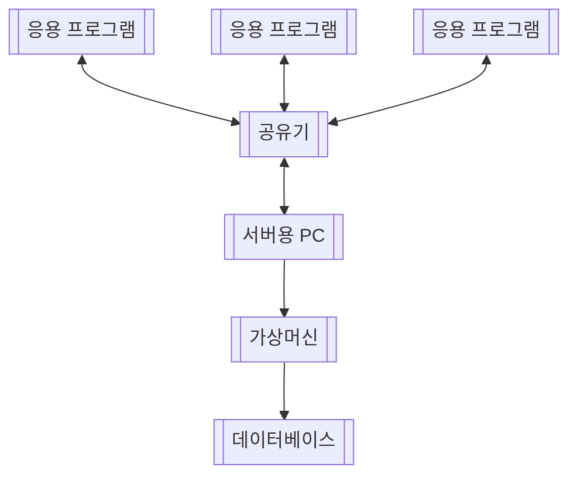
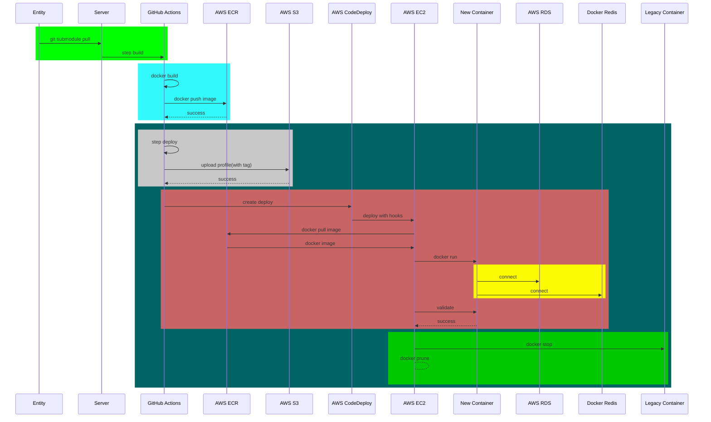
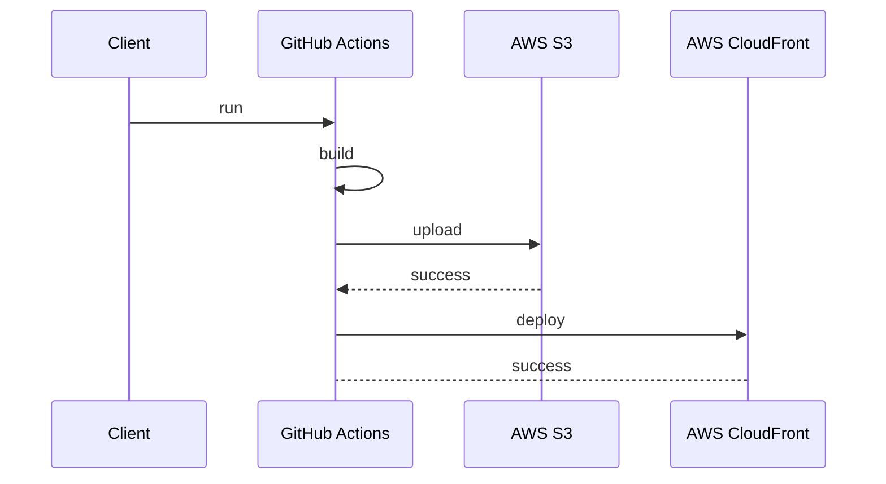

# 들어가며

IT 스타트업을 퇴사 후 약 1개월 반 동안 외주 프로젝트를 진행하였다. 외주 고객사는 예전에 다니던 연구소였으며, 연구소 다니던 시절 파이썬으로 개발한 응용 프로그램을 웹 애플리케이션으로 고도화하는 작업이었다. 개발 및 데이터베이스 마이그레이션은 무사히 마쳤고, 해당 연구소분들이 정상적으로 이용하고 있는 것을 확인하였다. 외주 프로젝트는 무사히 마쳤고, 약 1주일 간 운영하면서 로그를 확인하고 서버 보안에 대해서 주저리주저리 얘기해보고자 한다.

# 1. 레거시 프로그램

## 1.1. 기능 설명

연구도 다니던 시절 파이썬으로 개발한 응용 프로그램 중 하나는 시간 관리 프로그램이다. 프로젝트별 어떤 인원이 어느정도 시간을 투입했는지 등을 관리하고 집계하는 간단한 프로그램이었으며, 레거시 기능을 간략히 나열하면 다음과 같다.

1. 접속 IP 및 Port 설정
2. 회원갸입 및 로그인
3. 계정별 권한 설정
4. 내 정보 수정
5. 프로젝트 CRUD
6. 일자별 프로젝트 투입 시간 CRUD
7. 일자별 메모 CRUD
8. 인원 및 프로젝트별 시간 정보 집계
9. 집계 파일(.xlsx) 다운로드

그 외에 공지 게시판, 익명 설문 등이 있으나 주된 기능도 아니고 거의 이용하지 않았던 기능이라 위 항목에서는 제거하였다. 당시 프로그래밍을 접한 지 약 3개월 즈음 되었던 시기였던 탓에 여러 삽질을 해가며 약 6개월 동안 개발하였다. 이후 연구소에 있는 동안 해당 프로그램 버전 관리, 추가 기능(앞서 언급한 공지 게시판, 익명 설문, 채팅) 등을 업데이트 하였다.

## 1.2. 서버 및 통신 구조

해당 응용 프로그램의 서버 및 통신 구조는 다음과 같았다.



위 구조를 보면 알 수 있듯이 연구소 보안 특성상 외부에서는 접속할 수 없도록 개발하였고, 그 시절 서버와 클라이언트라는 개념을 몰랐기에 별도의 API 서버 없이 응용 프로그램에서 직접 DB에 연결하여 기능이 동작되도록 개발하였다. 서버 PC는 경영팀에게 요청하여, 사용하지 않는 최소한의 사양을 지닌 Windows 10 PC였으며, Oracle의 Virtual Box을 CentOS7 가상머신 내 MySQL을 설치하여 데이터베이스로 사용하였다.

## 1.3. 문제점

이 프로그램은 약 3년 간 사용되었으며, 아래와 같은 문제로 인해 고도화 외주 프로젝트를 진행하게 되었다.

- 장기 출장자는 내부 IP에 접속할 수 없으므로 해당 프로그램을 사용할 수 없다.

아래는 필자가 웹 개발을 공부하며 느낀 레거시 프로그램의 문제점들을 나열해보았다.

- 응용 프로그램 개발 후 배포하기 위해서는 컴파일 후 설치 마법사라고 불리우는 설치 프로그램까지 직접 적용시키고, 이를 사내 이메일로 전송해야 했다. 필자가 기억하는 마지막 버전은 v1.0.2x 이었으며, 약 20회 이상 배포하여 매번 번거로움을 느끼곤 했다.
- 별도의 서버 없이 클라이언트에서 DB에 직접 접속하는 것은 커넥션 관리, 취약한 보안 등 여러 이슈가 발생할 수 있는 원인이 될 수 있다.
- 프로그램는 비밀번호 찾기 기능이 있었다. 그 말인 즉슨, 비밀번호를 해싱처리하지 않았다는 것이다. 내부 IP라 큰 문제가 없었을 수도 있지만, 누군가가 DB 정보를 직접 조회하기만 하더라도 모든 인원들의 비밀번호가 유출될 수 있는 상태였다.
- DB 설계 시 관계를 맺지 않았기에 여러 쿼리를 날려 조회한 데이터를 for 문으로 가공하여 데이터를 처리하곤 했다. 뿐만 아니라 관계를 맺지 않았기에 DB 수정 및 기능 확장 시 수동으로 모든 쿼리를 검토 및 적용했기에 매우 고된 작업이었다.

## 1.4. 과거의 산물

연구소에 다녔던 시절에도 웹으로 개발하려는 시도를 수차례 시도한 적이 있다. 당시, 외부 서버를 구입할 수 없던 상황이라 무료로 서버를 구축할 수 있는 방법을 찾아야 하는 상태였고, 그 중에 직접 시도해보았던 것들은 다음과 같다.

### 1.4.1. Firebase

최초 시도는 응용 프로그램을 Firebase에 연결하는 방법이었다. 해당 코드가 있는지 찾아보니 아래 Repository가 있는 것을 확인하여 링크 남긴다.

- [GitHub - python-stdte-development](https://github.com/choewy/python-stdte-development)

해당 프로그램을 팀내 배포하였으나, 이내 Firebase의 요금 정책이 바뀌어 다시 레거시를 이용하게 되었다.

### 1.4.2. Google Sheet API

두 번째 시도는 Google Sheet API를 이용하는 방법이다. 이때는 필자가 React.js(16)을 한창 공부하기 시작한 때라 웹 애플리케이션으로 개발하고자 하였다. 해당 코드가 있는지 찾아보았으나, API key를 노출시키는 바람에 Repository를 비공개로 전환 후 해당 프로젝트가 중단되면서 아예 삭제한 것 같다. 당시 한양사이버대학교를 재학중인 상태였는데, Google Sheet API를 이용하여 졸업작품으로 제출한 Todo 웹 애플리케이션 링크를 남긴다.

- [GitHub - react-todo-app](https://github.com/choewy/react-todo-app)

Google Sheet API를 사용하려는 취지는 단 한가지였다. 무료였기에. 그러나, 매우 치명적인 문제가 있었는데, 데이터 처리 속도가 너무 느리다는 것이다. 이 문제점을 인지한 상태로 개발을 마친 후 당시 부서장님께 보여드렸는데, 보여드린 것이 죄송스러운 정도로 너무 느렸기에 레거시를 그대로 이용하기로 하였다.

> 로그인하는데만 약 2\~3초, 테이블을 구성하는 데이터를 호출하는데 약 5초, 데이터 하나를 추가하는데 약 3초가 소요되었다. 이정도면 괜찮은데? 버튼 클릭 한 번당 2\~5초간 로딩하고 있는 모습을 보고 있자면 한국인 감성에는 전혀 맞지 않을 정도로 답답함을 느꼈다.

# 2. 외주 프로젝트 진행

연구소를 퇴사하고 난 이후에도 부서장님을 비롯한 몇몇 인원들과 아직도 연락하며 지내고 있다. 23년 4월, 부서장님은 시간 관리 프로그램 고도화 작업을 외주 프로젝트로 제안했고, 필자는 흔쾌히 승락하였다. 당시 IT 스타트업에서 백엔드 개발자로 근무 중이었으며, 마침 퇴근 후 어떤 사이트 프로젝트를 진행할까 고민 중이었던 때라 매우 반가운 제안이었다. 23년 7월 배포를 하였으나, 당시 부서장님의 건강 문제로 인해 해당 프로젝트는 전면 중단되었다. 시간이 흘러 IT 스타트업 퇴사 후 부서장님과 만나게 되었고, 그때서야 프로젝트를 다시 진행하기로 하였다. 실제 코드는 GitHub에 공개로 남겨놓았으므로 이번 장에서는 간략하게 기능과 배포 방식에 대한 설명만 남겨놓도록 하겠다.

## 2.1. 기능 설명

고도화한 웹 앱의 기능은 다음과 같다.

1. 로그인 및 회원가입
2. 역할 및 정책 도입
3. 계정 상태 관리(가입 승인, 거절, 비활성)
4. 내 정보 수정
5. 프로젝트, 고객사, 산업분야, 사업구분 등 CRUD 및 파일(xlsx) 다운로드
6. 일자별 프로젝트 투입 시간 및 메모 CRUD
7. 인원변동 현황 집계 및 파일(xlsx) 다운로드
8. 시간 집계 및 파일(xlsx) 다운로드
9. 프로젝트별 수주 및 매출 이력 CRUD 및 파일(xlsx) 다운로드

기존 레거시에 있던 공지 게시판, 익명 설문은 구현하지 않기로 하였고, 시간 관리 테이블은 실시간으로 구현하기로 하였다.

## 2.2. 서버 배포 과정

본 프로젝트는 총 5개의 GitHub Repository로 구성되어 있다. 이 중 3개는 public으로 열어놓았고, 나머지는 private로 닫아놓았다. 이 중에서 3개가 서버이고, 1개는 클라이언트, 나머지 1개는 migration 스크립트이다. 서버 배포 시 쿠버네티스를 이용하려고 했으나, 연구소로부터 EC2와 RDS를 RI(Reserved Instances)로 구매해놓은 AWS 계정으로 전달받았고, 아쉬운대로 EC2에 Docker 컨테이너 배포를 적용하기로 하였다.



## 2.3. 클라이언트 배포 과정

클라이언트 배포 과정은 서버에 비해 매우 심플하다.



# 3. 여러 공격 시도 분석

해당 웹 앱을 배포한지 약 2주가 지났고, 매일 로그를 확인하며 다양한 공격 시도를 보았다. 먼저, 필자는 매일 새벽 5시에 서버 요청 및 응답 수치를 Slack으로 알려주도록 스케줄러를 구현하였다. 예를 들어, 이 글을 작성하는 오늘(24년 01월 18일 목요일)에는 24년 01월 17일 수요일의 로그 수치를 슬랙으로 알림받는다. 아래는 실제 서버 배포 후 얼마되지 않았을 때 Slack으로 알림받은 실제 로그 수치이다.

- 성공 : 980건
- 실패 : 8931건
- 오류 : 1402건

위의 성공은 200대 응답을 처리한 건수이고, 실패는 400대 응답, 오류는 500대 응답 또는 프로세스 오류가 발생한 건수이다. 아침에 일어나서 실패 건수를 보고 로그를 확인해보았는데 약 4개의 해외 IP에서 해킹 시도 요청을 보낸 것을 확인하였다. 그 내용을 추려보면 다음과 같다.

- 환경 변수 파일 조회(`.ini`, `.env` 등)
- XSS 공격 시도
  - `*.php`로 요청을 보낸 후 파라미터에 js, sql 스크립트가 포함되어 있음
- 웹 쉘 업로드 및 웹 쉘 실행 시도
  - 요청 본문에 `*.sh`파일을 업로드하려는 시도가 있음
  - 요청 파라미터에 Linux Shell Script가 포함되어 있음
- AWS 계정 탈취 시도
  - 요청 본문 또는 파라미터에 `aws`, `aws/credentials`와 같은 내용이 포함되어 있음
- Slow Http Test(일명, RUDY Attack) 시도
  - 요청 본문에 알 수 없는 매우 큰 크기의 문자열이 담겨있으며, 해당 IP가 보낸 요청에는 `Request aborted`라는 오류 메시지가 남아 있음

위의 IP들을 집계 후 검색해본 결과 미국, 중국, 독일, 프랑스, 일본 순으로 요청 건수가 존재했으며 이중에는 Azure, AWS 인스턴스도 존재했다.

# 4. 대응 방법

## 4.1. 공격자의 정보 노출시키기

위 실패 로그의 응답 코드는 대부분 404였다. 필자는 NotFoundException를 커스터마이징해서 사용하고 있으며, 직접적으로 NotFoundException이라는 예외가 남지 않도록 하였다. 예를 들어, 아래와 같이 말이다.

```ts
export class NotFoundUserException extends NotFoundException {
  constructor(id: number) {
    super();

    this.name = NotFoundUserException.name;
    this.message = `not found user : ${id}`;
  }
}
```

서버에서 위의 예외를 던지면 아래와 같은 응답을 보낸다.

```json
{
  "statusCode": 404,
  "name": "NotFoundUserException",
  "message": "not found user : 1"
}
```

그럼에도 이 로그에 쌓인 공격시도의 예외들은 모두 NotFoundException으로 기록되어 있다.

```json
{
  "statusCode": 404,
  "name": "NotFoundException",
  "message": "GET / NotFound"
}
```

이 로그들 보고 있자니 순간 번뜩이는 아이디어가 하나 떠올랐다. 반대로 공격자의 정보를 응답으로 노출시키는 것이다. 별건 아니지만 공격자에게 아래와 같은 경각심을 주기 위함이랄까?

> "너 뭐하냐? 나 너 IP 알고 있어 임마. 그러니 계속해 봐."

물론, 경각심이 아니라 되려 오기를 불러일으키는 도발 행위가 될 수 있겠다는 생각도 들긴 했으나, '과연, 이 서버를 어떻게 뚫게 될 것인가?'라는 호기심도 있어서 그런지 위 방법을 바로 적용하기로 하였다. NestJS의 ExceptionFilter에서 해당 예외가 NotFoundException이면 아래와 같은 예외를 던져주도록 하였다.

```ts
{
  statusCode: 404,
  name: "WhatAreYouDoing",
  message: "I remember your ip addr",
  yourIpAddr: "127.0.0.1"
}
```

위의 `yourIpAddr`에는 공격자의 실제 IP 주소가 출력된다. AWS ALB를 사용하면 `request.ip`는 AWS ALB의 IP가 출력되는데, 실제 IP를 알아내려면 아래와 같이 하면 된다.

```ts
request.ip; // AWS ALB IP
request.headers['x-forwarded-for']; // 실제 공격자의 IP
```

위 코드를 반영하기 전까지만 해도 한 IP 당 실패 요청 건수는 약 80회 이상이었으나, 위 코드를 반영하고 난 후에는 한 IP 당 실패 요청 건수가 약 20회 정도로 눈에 띄게 줄어든 것을 확인하였다.

## 4.2. Throttler 적용 및 RUDY Attack 테스트

위 대응 방안을 적용하였음에도 불구하고 소수의 IP에서 무차별 요청을 보낸 기록을 확인하였다. 약 4개의 IP에서 1초당 약 12건 이상의 요청을 계속 보낸 기록이 있었고, 이에 Throttler를 적용하기로 하였다. NestJS 공식 문서에 Throttler Module에 관하여 자세하게 기재되어 있으므로 별도의 설명은 생략하겠다. Throttler Storage는 Redis를 이용하였고, 10초 간 50회 이상의 요청을 보내면 429 응답을 보내주는 Guard를 적용시켰다. 필자가 개발한 클라이언트에서는 1초간 최대 3회의 요청을 보낼 수 있으므로 10초간 50회로 정하였다.

> 웹 앱 로그인 시 인가 확인, 공통 설정 조회, 페이지에 따른 데이터 요청을 위한 Request를 보내고(누적 3회), 이후부터는 단 건 1회 씩 요청을 보내도록 하였다. 그렇기에 10초 간 50회면 무차별 요청 시도로 간주할 수 있을 수준이라고 판단하였다.

무차별 요청 시도에는 Slow Http Test(일명, RUDY Attack)으로 의심되는 요청도 있었는데, 이들 특징은 다음과 같다.

- POST 요청을 보낸다.
- 요청 본문에 알 수 없는 긴 해시 문자열을 보낸다.
- 반드시 서버 쪽 오류 로그에 해당 IP가 기록되어 있으며, request aborted라는 메시지가 남는다.

RUDY Attack은 웹서버의 가용량을 모두 사용하여 정상적인 서비스가 불가능하도록 하는 GET Flooding 공격 유형이며, 필자가 NodeJS로 구축한 테스트 서버에 Rudy Attack을 시도해본 결과 다음과 같았다.

- 다른 요청이 정상적으로 처리된다.
- RUDY Attack 실행이 종료되거나, 중간에 멈춘 경우 서버 쪽에 request aborted라는 오류 로그가 기록된다.

그 결과를 보고 아래와 같은 생각이 들었다.

> Node.js로 구축한 서버에는 RUDY Attack이 안 통하는 것인가?

조만간 Python, Java, PHP로 서버를 구축해보고 RUDY Attack 테스트를 다시 진행 후 그 결과를 분석해 볼 예정이다(다만, 언제 포스팅은 하게 될지는 알 수 없다).

## 4.3. IP Black List 적용

마지막으로 위에서 공격 시도한 IP들은 모두 BlackList에 추가해놓았으며, 해당 IP로부터 들어온 요청은 모두 YouAreBlockedException이라는 418 오류를 던지도록 적용시켰다. 더 간단하게는 AWS에서 허용할 IP들만 보안 그룹에 추가하는 방법도 있겠으나, 해당 IP가 계속 공격시도하는 것을 보고 싶다는 조금 변태같은 생각으로 인해 서버 애플리케이션 계층에서 처리하도록 하였다.

# 5. 대응 결과

서버를 공격시도하려는 로그를 보면 필자가 구축한 서버를 어떻게 뚫으려냐 하는 궁금증에 매우 흥미가 생긴다. 동시에 여러 대응 방안을 적용해보면서 공격자의 공격 횟수가 줄어드는 것을 보면 또 다른 희열이 느껴진다. 아래는 오늘 새벽 5시에 전달받은 어제(23년 01월 17일 수요일) 로그 수치이며, 앞서 보여준 수치보다 실패 건 수가 현저하게 줄어든 것을 확인할 수 있다.

- 성공 : 1666
- 실패 : 1360
- 오류 : 28

오류 로그를 확인한 결과 시스템 오류는 없었으며, 전부 request aborted인 것을 확인하였다. 해당 로그 내용을 자세히 보니 역시나 RUDY Attack인 것을 의심해볼 수 있었고, 해당 IP도 블랙 리스크에 등록해놓았다.

# 마치며

오늘은 필자가 외주 프로젝트를 개발 후 운영하는 과정에서 확인한 보안 공격 시도에 관해서 정리해보았다. 공격 시도 요청 로그를 확인하면서 보안에 대해서 조금 흥미를 느낀 계기가 되지 않았나 싶다. AWS RDS나 EC2는 전부 private 네트워크로 구성하였고, bastion 서버로 터널링을 해야만 접속되도록 인프라를 구성하였기에 현재 상황이 흥미롭게 받아들여질 수도 있겠으나, 보안에 대해서도 꾸준히 공부해야겠다는 생각이 들었다. 위에도 언급했지만 조만간 Python, PHP, Java Spring으로도 서버를 구축해보고 RUDY Attack을 실습 후 그 결과를 분석할 예정이다.
