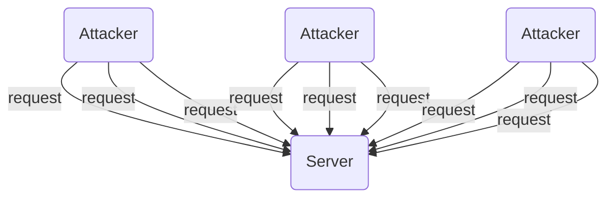
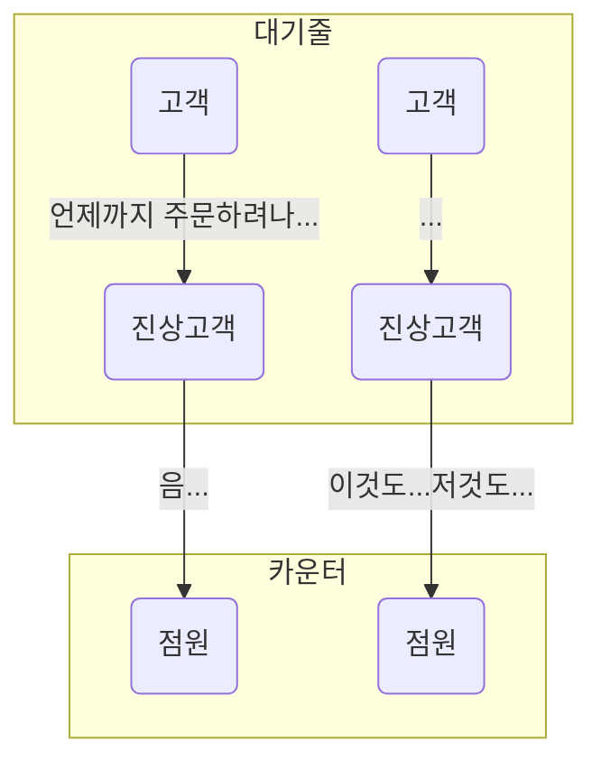

# 들어가며

오늘은 지난 글에서 언급했던 RUDY(R U Dead Yet?) 공격에 대해서 공부하고, 직접 실습해보면서 얻게된 정보를 정리하고자 한다.

## 1. DoS

RUDY 공격 또한 DoS 공격 중 하나이므로 DoS에 대한 간단한 내용부터 알아보겠다. DoS는 Denial of Service의 약자로, 서비스 거부 공격이라는 의미이다. 이는 공격 대상 시스템 또는 서버에 과도한 부하를 발생시켜 다른 이들이 서비스를 이용하지 못하도록 방해하는 공격 기법이다. DoS 공격에는 여러 공격 기법이 있으며, 알아본 내용에 따르면 크게 두 가지 성격으로 분류할 수 있다.

### 1.1. DDoS

가장 잘 알려진 DDoS(Distributed Denial of Service, 분산 서비스 거부 공격)가 있다. 이는 서비스 중단을 목적으로 공격 대상에게 대용량 트래픽을 보내 서버의 가용량을 침해하여 다른 이용자가 서비스를 이용하지 못하도록 방해하는 공격이다. 앞서 언급한 것과 같이 DDoS 공격 기법은 공격 대상에게 무차별적인 대용량 트래픽을 보내는 것이므로 어찌보면 매우 단순 무식한 방법이라고 할 수 있다. DDoS 공격 사례를 검색해보면 대규모 커뮤니티 집단에서 하나의 웹 사이트를 새로고침 하나로 무너뜨린 사례도 있다. 이렇듯 연속 새로고침만으로도 무차별적인 트래픽을 보낼 수 있기에 가능한 공격 기법이다.



### 1.2. Slowloris

Slowloris 공격은 Slow HTTP DoS라고도 하며, 위에서 정리한 DDoS와는 다른 성격을 지닌 DoS 공격 기법이다. 이는 공격 대상 서버에 HTTP 요청 패킷의 Header를 변조하여 동시에 많은 HTTP 연결을 유지하여 서버의 가용량을 침해하는 DoS 공격 기법이다. 서버마다 요청을 처리하는(또는, 연결을 유지하는) 가용량이 있는데, Slowloris는 서버에게 요청을 매우 천천히 보내거나, Header를 변조하여 요청이 끝나도 연결을 끊지 못하도록 하는 진상 공격 기법이다. Slowloris는 다시 크게 Slow HTTP Header DoS, Slow HTTP POST DoS, Slow HTTP Read DoS로 나뉜다.

- Slow HTTP Header DoS : 요청 Header의 끝을 의미하는 빈 라인의 개행을 전달하지 않고, 지속적으로 불필요한 Header를 추가하여 연결 상태를 유지하는 공격 기법이다.
- Slow HTTP GET DoS: HTTP 요청을 보낸 후 요청 Header의 Windows 필드의 크기를 매우 작게(혹은 0으로) 설정하여 연결 상태를 유지하는 공격 기법이다.
- Slow HTTP POST DoS : 요청 Header의 Content-Length를 비정상적으로 크게 지정하고, 서버와 연결이 유지된 상태에서 서버가 지정한 Timeout에 도달하기 전에 매우 작은 데이터를 천천히 전송하여 연결 상태를 유지하는 공격 기법이다.

위의 Slow 계열 공격 기법 중 Slow HTTP POST DoS를 RUDY Attack이라고 하며, 이제부터 RUDY Attack에 대해서 다뤄보겠다.

# 2. RUDY Attack

RUDY는 Are(R) You(U) Dead Yet?의 약자로, 이를 해석하면 `너 아직 안 죽었니?`라는 의미를 나타낸다. 이는 Slow HTTP DoS 공격 중 POST DoS에 해당하며 개발자의 보안 설정 오류 또는 애플리케이션, 프레임워크 등이 최신 버전이 아닌 경우의 취약점을 활용한 공격 기법 중 하나이다. DDoS 공격은 많은 사람들이 참여하는 데모 또는 시위로 비유할 수 있다면, Slow 공격 기법은 어떤 음식점에 1~2명의 진상 손님이 나타나서 장사를 못하게 방해하는 것으로 비유할 수 있다.



> 아래 참고자료에서 노말틱(Normaltic)님께서 아주 쉽게 설명해주셔서 금방 이해가 되었다.

RUDY 공격은 위에서 설명한 바와 같이 서버의 keepAlive의 취약점을 활용하여 비정상적인 크기의 데이터를 잘게 쪼개어 보내 커넥션을 점유한다. [이전에 업로드한 글](https://choewy.tistory.com/162)에서도 서버 공격 로그를 보고 RUDY 공격 시도라고 판단했던 로그들은 모두 POST 요청이었으며, 요청 본문에 알 수 없는 긴 문자열이 남아있었다.

## 2.1. 직접 구현해보기

RUDY 공격에 대해서 검색해 본 결과, 해당 공격은 대체적으로 Apache 서버에 유효하다는 것을 알게 되었다. 그런 탓인지 몰라도 국내에서 설명하는 RUDY 공격에 대한 글은 대체적으로 Apache, PHP를 타켓으로 설명하고 있었다.

> 여러 개의 탭을 띄워놓은 상태에서 실수로 해당 글의 탭을 닫아버리는 바람에 링크를 남기지 못했으나, 나중에 찾아서 아래 참고자료에 추가해놓겠다.

이전에 업로드한 글에서의 서버는 NestJS 프레임워크로 개발한 Node 서버이며, 과연 Node 서버에도 RUDY 공격이 통할까?라는 궁금증이 생겨서 직접 테스트해보기로 하였다. 먼저, [GitHub - rudy](https://github.com/SergiDelta/rudy)코드를 참고하여 Python으로 RUDY 공격을 수행하는 코드를 재구성하였다. 이때, 테스트 용도로만 사용하도록 proxy 설정 부분은 전부 제거하였고, Python 11 버전에 맞게 코드를 일부 수정 및 리팩토링하였다. README에도 작성해놓았듯이 아래 명렁어를 통해 http://localhost:3000에 RUDY 공격을 실행할 수 있다.

- [GitHub - r-u-dead-yet](https://github.com/choewy/r-u-dead-yet)

```zsh
python3 main.py http://localhost:3000 -t 10
```

코드를 보면 알 수 있듯이 위의 명령어로 RUDY를 실행하면 해당 서버에 150개의 소켓을 연결한 후 10초마다 1byte의 데이터를 보내어 서버에서 timeout으로 연결을 끊지 못하게 지속적인 요청을 보내도록 하였다.

## 2.2. 테스트

RUDY 코드를 테스트해보기 위하여 Express, Nest, Flask, Spring Boot 서버를 구축하여 테스트를 진행해보았다.

### 2.2.1. Express

이를 테스트보기 위하여 가장 먼저 Express로 간단한 서버를 구축해보았다. 이때, 해당 서버에는 별도의 설정을 하지 않고 프레임워크에서 기본으로 제공하는 설정으로 서버를 구축하였다.

> 아래는 최초로 작성한 Express 서버 코드이다. 최종 코드는 본 절의 끝 부분에 링크를 남겨놓았다.

```js
const express = require('express');
const app = express();

app.get('/', (_, res) => {
  return res.status(200).send('GET');
});

app.post('/', (req, res) => {
  return res.status(201).send(req.body);
});

app.listen(3000, '::');
```

구축한 서버에 RUDY 공격을 시도한 결과 150개 소켓 모두 Timeout이 발생하였으며, express에서 Timeout을 재설정하기 위하여 http 모듈에 Express를 바인딩하여 서버를 재구축한 후 재시도하였다. RUDY가 실행되는 동안 웹 브라우저를 열고 http://localhost:3000으로 접속해보았다. 만약, RUDY 공격이 통했다면 웹 브라우저로 요청한 GET 요청은 처리되면 안 된다. 그러나, 웹 브라우저로 요청한 GET 요청은 너무나도 정상적으로 처리된 것을 확인하였다. 그 이유를 파악하기 위해 구글링한 결과, 다음과 같은 내용을 찾을 수 있었다.

- [Node.js의 동시 HTTP 연결](https://tpiros.dev/blog/concurrent-http-connections-in-node-js/)

> Node.js 초기(v0.10 이하)에는 단일 호스트와의 동시 연결이 5개로 제한되었으나, 0.10보다 높은 버전에서는 maxSockets 값이 Infinity이다.

Node.js의 Express는 http 모듈을 사용하는데, 버전이 올라감에 따라 maxConnection이 Infinity가 되었기 때문에 Infinity보다 적은 수의 Socket 연결로 보낸 POST 요청은 모두 처리할 수 있다는 의미로 해석하였다. 그러면, 서버쪽에서 maxConnection을 RUDY로 연결하는 소켓 수 보다 적게 설정하면 될 것이라고 생각하여 서버쪽의 maxConnections을 10으로 재설정 한 후 테스트해보았다. 다시, RUDY가 실행하고 있는 동안 웹 브라우저로 GET 요청을 보낸 결과, Express 서버가 먹통이 된 것을 확인할 수 있었다.

- [GitHub - r-u-dead-yet/servers/express](https://github.com/choewy/r-u-dead-yet/tree/master/servers/express)

```ts
export class Server {
  express: express.Express;
  http: http.Server;

  constructor(
    private readonly port: number = 3000,
    private readonly host: string = '::',
    keepAliveTimeout: number = 10000,
    maxConnections: number = 10,
  ) {
    this.express = express();
    this.http = http.createServer(this.express);
    this.http.keepAliveTimeout = keepAliveTimeout;
    this.http.maxConnections = maxConnections;
  }
}
```

### 2.2.2. NestJS

두 번째로 NestJS로 구축한 서버도 테스트해보았다. 여기부터는 프레임워크에서 제공하는 기본 설정, 수정한 서버 설정으로 나누어 2회 테스트해보았다. 먼저, NestJS CLI로 생성한 프로젝트에 POST 라우터만 구현하고 테스트해보았으나, 너무도 당연하게 RUDY 터미널 로그에 Timeout Error가 발생한 것을 확인할 수 있었다. 이후, keepAliveTimeout과 maxConnections 설정을 아래와 같이 재설정한 후 테스트한 결과 NestJS 서버도 먹통이 된 것을 확인할 수 있었다.

- [GitHub - r-u-dead-yet/servers/nest](https://github.com/choewy/r-u-dead-yet/tree/master/servers/nest)

```ts
import { Server } from 'http';

import { NestFactory } from '@nestjs/core';

import { AppModule } from './app.module';

async function bootstrap() {
  const app = await NestFactory.create(AppModule);
  const server = app.getHttpServer() as Server;

  server.keepAliveTimeout = 10000;
  server.maxConnections = 10;

  await app.listen(3000);
}
bootstrap();
```

추가로, RUDY를 실행 후 도중에 멈추면 NestJS 서버에 아래와 같은 오류 로그가 남는다.

```log
[Nest] 42119  - 2024. 01. 19. 오후 8:46:32   ERROR [ExceptionsHandler] request aborted
```

위 로그에 대해 검색한 결과, body-parser에서 요청 본문 읽기가 완료되기 전에 client에서 요청을 중단했기에 발생시킨 오류라고 한다. 위의 Express에서는 발생하지 않은 이유는 http 서버에 별도의 error 이벤트를 수신할 수 있도록 코드로 구현해놓았기 때문이다.

- [ExpressJS - body-parser](https://expressjs.com/en/resources/middleware/body-parser.html)

> **request aborted** : This error will occur when the request is aborted by the client before reading the body has finished. The received property will be set to the number of bytes received before the request was aborted and the expected property is set to the number of expected bytes. The status property is set to 400 and type property is set to 'request.aborted'.

### 2.2.3. Flask

세 번째로 Flask로 구축한 서버도 테스트해보았다. 마찬가지로 최초 테스트 시에는 어떠한 설정도 하지 않은 상태로 진행했으며, 그 결과 RUDY 공격이 실패한 것을 확인하였다. Flask의 keepAliveTimeout, maxConnections를 수정하기 위하여 구글링해보았으나, 해당 속성은 찾을 수 없었다. 정확히는 Flask에 해당 속성은 없다. Flask는 WSGI 서버 기반으로 동작하며, Flask 실행 시 추가한 인자값으로 WSGI 서버 설정값이 적용된다. WSGI 서버 설정에는 processes, threaded라는 속성이 있었으며, processes를 1로, threaded는 사용하지 않도록 재설정 후 테스트한 결과, Flask 서버도 먹통이 된 것을 확인할 수 있었다.

- [GitHub - r-u-dead-yet/servers/flask](https://github.com/choewy/r-u-dead-yet/tree/master/servers/flask)

```py
from werkzeug.serving import WSGIRequestHandler
from flask import Flask, Blueprint
from typing_extensions import List


class Application(Flask):
  def __init__(self, port: int, host: str, debug: bool = True):
    Flask.__init__(self, __name__)

    WSGIRequestHandler.protocol_version = "HTTP/1.1"

    self.port = port
    self.host = host
    self.debug = debug

  def listen(self) -> None:
    self.run(self.host, self.port, self.debug, processes=1, threaded=False)

    return self
```

### 2.2.4. Spring Boot

마지막으로 Spring Boot로도 서버를 구축 후 테스트를 진행하였다. 마찬가지로 아무런 설정도 건드리지 않은 최초 테스트 결과는 RUDY 공격이 실패한 것을 확인하였다. Gradle로 생성한 Spring Boot 프로젝트의 초기 timeout 값이 10000으로 설정되어 있음을 확인하였으므로 timeout 값은 수정하지 않았고, application.properties에서 요청을 처리할 수 있는 최대 쓰레드 수를 10으로 재설정 후 테스트한 결과 Spring Boot 서버도 먹통이 된 것을 확인하였다.

- [GitHub - r-u-dead-yet/servers/spring-boot](https://github.com/choewy/r-u-dead-yet/tree/master/servers/spring-boot)

```conf
server.port=3000
server.tomcat.threads.max=10
```

# 3. 결론

이번 실습으로 확인할 수 있는 것들로는 다음과 같다.

1. 기본적으로 서버가 처리할 수 있는 기본 가용량이 높아짐에 따라, RUDY 공격 시 서버 측에서 keepAliveTimeout으로 연결을 끊지 않는 이상 실제 요청은 정상적으로 이루어진다는 것을 확인할 수 있었다(실제 서버쪽 로그도 정상으로 찍히는 것을 확인하였다).
2. 가급적 최신 버전의 라이브러리 또는 모듈을 사용해야 하는 이유가 분명해졌다.
3. 사용자가 많고 유동이 많은 서비스의 경우 keepAlive를 사용하지 않거나, keepAlive Timeout을 짧게 설정하는 것이 좋겠다. 그렇지 않으면, connection 점유로 인하여 새로운 요청을 받아들이지 못할 수 있기 때문이다.
4. TCP 4-way Handshaking, TCP 3-way Handshaking, TimeWait 등에 관한 내용도 깊게 공부해야 할 필요성을 느꼈다.

# 마치며

집에서 혼밥하면 주로 유뷰브를 틀어놓곤 한다. 어느날, 노말틱님의 채널이 알고리즘에 떠서 아무런 생각없이 틀어놓고 있었는데, 그때 나온 영상이 RUDY 공격에 대한 설명이었다. 그전까지는 서버 보안에 크게 관심이 없었는데, 가볍게 흘려 들었던 내용을 직접 로그로 확인해보고, '이게 RUDY 공격이겠구나'라고 판단하고, 직접 실습해보면서 정말 많은 공부가 되었다. 뿐만 아니라 TCP/IP 요청의 보다 깊고 자세한 내용, 네트워크와 통신 등 더 많은 호기심이 생긴 계기가 된 것 같다. 조만간 TCP/IP 통신에 대해서도 공부하고 정리할 예정이다(언제 포스팅할 지는 미지수).

# 참고자료

- [Cloudflare - RUDY 공격이란?](https://www.cloudflare.com/ko-kr/learning/ddos/ddos-attack-tools/r-u-dead-yet-rudy/)
- [YouTube - (Normaltic)스마트한 디도스, RUDY 공격 쉽게 이해해보기](https://youtu.be/UNOuh8rJB_I?si=kSme4lpcIhX5MYwX)
- [Tistory - Slow 계열 공격 유형 실습](https://motie.tistory.com/93)
