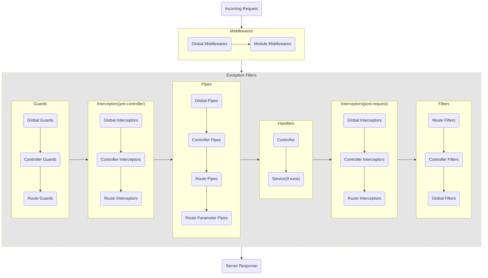

# 들어가며

Docker로 ElasticSearch, Logstash, Kibana를 이것저것 설정하면서 놀다가 실제 로그를 쌓아줄 서버가 필요해서 바로 NestJS 프로젝트를 생성했다.

- [GitHub/choewy/nestjs-logger-boilerplate](https://github.com/choewy/nestjs-logger-bolierplate)

이것저것 설정을 변경해보며 구글링하면서 놀던 중에 StackOverflow에서 재미있는 질문을 보았다.

> NestJS의 Filter에서 host(ArgumentsHost)를 통해 핸들러 정보를 가져오는 방법에 대해 알려주세요.

약 1년 전, 필자가 실제로 겪었던 상황이었기에 자세한 내용을 안 보고도 질문자가 무엇을 원하고 있는지 충분히 짐작할 수 있었다. 해당 질문에 대한 답은 NestJS 공식 문서에 명확하게 기재되어 있었으며, 주말에 따로 시간내서 공부한 기억을 떠올린 것과 동시에 '아, 내가 블로그에 올린 적이 있던가?'라는 생각이 떠올랐다.

# 1. 개요

과거의 기억을 떠올려 로그의 데이터를 다시 짜보았다. 필자가 쌓고자 하는 로그에는 다음과 같은 정보가 있다.

```ts
export class HttpLogVo {
  readonly context: string;
  readonly message = '';
  readonly status: number;
  readonly method: string;
  readonly url: string;

  readonly request: {
    ip: string;
    xforwardedfor: string;
    params: Record<string, unknown>;
    query: Record<string, unknown>;
    body: unknown;
  };

  readonly exception: {
    name: string;
    message: string;
    cause: unknown;
  };
}
```

위 VO에서 `context`는 Interceptor, Guard의 intercept, canActive 메소드 인자로 넘어온 ExecutionContext의 `getClass`, `getHandler` 메소드를 통해 꺼내온 컨텍스트 이름(클래스명, 메소드명)이다. `context`를 로깅하려는 의도를 요약하면 `어떤 클래스 또는 어떤 메소드에서 로깅이 되었는가?`이다. 이를 테스트하기 위해 `AppController`에 4개의 라우터를 구현했다.

```ts
@Controller()
export class AppController {
  constructor(private readonly appService: AppService) {}

  @Get('ok')
  getOkResponse(): void {
    return;
  }

  @Get('fail')
  throwException(): never {
    throw new BadRequestException();
  }

  @Get('error')
  throwError(): never {
    throw new Error('test error');
  }

  @Get('guard')
  @UseGuards(AuthGuard)
  throwExceptionByGuard(): never {
    return;
  }

  @Get('pipe')
  @UsePipes(AlwaysFailedPipe)
  throwValidationPipe(@Param() params: never): never {
    return;
  }
}
```

각 엔드포인트는 다음과 같은 역할을 한다.

- `/ok` : 요청에 대한 응답이 성공하는 경우
- `/fail` : 요청에 대한 응답이 예외로 인해 실패하는 경우
- `/error` : 요청에 대한 응답이 예기치 못한 시스템 오류로 인해 실패하는 경우
- `/guard` : 요청에 대한 응답이 Guard에서 발생한 예외로 인해 실패하는 경우
- `/pipe` : 요청에 대한 응답이 Pipe에서 발생한 예외로 인해 실패하는 경우

그리고 위 엔드포인트들에 대한 로그는 아래 컨텍스트에서 쌓는다.

- 성공 : `LoggingInterceptor`
- 실패 : `AllExceptionFilter`

```ts
export class LoggingInterceptor implements NestInterceptor {
  constructor(private readonly logger: Logger) {}

  intercept(context: ExecutionContext, next: CallHandler): Observable<any> {
    return next
      .handle()
      .pipe(tap(() => this.logger.verbose(new HttpLogVo(context))));
  }
}
```

> LoggingInterceptor는 Provider로 주입하지 않고 bootstrap에서 인스턴스로 생성하여 globalInterceptor로 사용하기 위해 Injectable 데코레이터를 사용하지 않았다.

```ts
@Catch()
export class AllExceptionFilter implements ExceptionFilter {
  constructor(private readonly logger: Logger) {}

  catch(err: HttpException | Error, host: ArgumentsHost) {
    let exception: HttpException;
    let type: keyof Pick<Logger, 'warn' | 'error'>;

    if (err instanceof HttpException) {
      exception = err;
      type = 'warn';
    } else {
      exception = new InternalServerErrorException({
        name: err.name,
        message: err.message,
      });
      type = 'error';
    }

    this.logger[type](new HttpLogVo(host, exception));

    host
      .switchToHttp()
      .getResponse<Response>()
      .status(exception.getStatus())
      .send({
        name: exception.name,
        message: exception.message,
        statusCode: exception.getStatus(),
      });
  }
}
```

위 엔드포인트 중에서 3개의 요청은 모두 정상적으로 로그가 쌓였으나, Guard와 Pipe에서 발생한 예외로 인해 쌓인 로그에는 context가 누락되어 있음을 확인하였다. 왜 Guard에서 예외가 발생한 후 Filter에서 로그를 쌓았을 때 context 정보가 누락되어 있을까?

# 2. NestJS Request Lifecycle

먼저, NestJS에서 요청이 들어왔을 때 각각의 컨텍스트 실행 순서에 대해서 알아보자.


위 그림을 조금 더 세분화한 그래프를 그려보았다.



위 그래프를 보면 알 수 있듯이, Guard와 Pipe에서 발생한 예외는 Controller에 도달하기 전에 발생했으므로 Filter에서 host(`ArgumentsHost`)의 인터페이스를 `ExecutionContext`로 갈아끼운 후 아래 코드 결과를 보면 `undefined`로 나타나는 것을 확인할 수 있다.

```ts
@Catch()
export class AllExceptionFilter implements ExceptionFilter {
  constructor(private readonly logger: Logger) {}

  catch(err: HttpException | Error, host: ExecutionContext) {
    console.log((host.getClass() ?? host.getHandler())?.name);
  }
}
```

반면, Guard에서 context(`ExecutionContext`)를 통해 실행 컨텍스트를 출력해보면 AppController가 정상적으로 출력되는 것을 볼 수 있다.

```ts
@Injectable()
export class AuthGuard implements CanActivate {
  canActivate(
    context: ExecutionContext,
  ): boolean | Promise<boolean> | Observable<boolean> {
    console.log((context.getClass() ?? context.getHandler())?.name);

    return false;
  }
}
```

# 3. ExecutionContext와 ArgumentsHost

NestJS 공식문서에 기재된 내용에 따르면 `ExecutionContext`와 `ArgumentsHost`는 각각 서로 다른 목적을 가진 객체라고 할 수 있다.

- [execution-context](https://docs.nestjs.com/fundamentals/execution-context)

`ExecutionContext`는 현재 실행 중인 요청에 대한 컨텍스트 정보를 담고 있다. 주로 미들웨어나 예외 필터에서 사용되며, 현재 실행 중인 요청에 대한 정보를 추출하고 조작할 수 있다. 반면, `ArgumentsHost`는 예외 필터에서 사용되며, 예외가 발생했을 때 예외 처리에 필요한 컨텍스트 정보를 통해 응답 객체에 접근하거나 상태 코드를 변경할 수 있다. 이를 요약하면, `ExecutionContext`는 현재 실행 중인 요청에 대한 일반적인 컨텍스트 정보를 다루기 위함이고, `ArgumentsHost`는 예외 처리에 필요한 컨텍스트 정보를 다루기 위한 목적이라고 할 수 있다. 어쩃거나 이 둘은 모두 컨텍스트 정보를 다룰 수 있다는 공통점이 있다. 그런데 왜 Filter에서 `getClass`, `getHandler`를 실행하면 `null`이 될까?

> 실제 코드로 확인해보면 `ExecutionContext`와 `ArgumentsHost`는 모두 같은 속성을 지니고 있다. `ArgumentsHost` 인터페이스를 `ExecutionContext` 으로 치환하면 `getClass`, `getHandler` 메소드를 호출할 수 있다.

```ts
console.log(Object.getOwnPropertyDescriptors(host));

/*
{
  args: {
    value: [ [IncomingMessage], [ServerResponse], [Function: next] ],
    writable: true,
    enumerable: true,
    configurable: true
  },
  constructorRef: { 
    value: null,
    writable: true,
    enumerable: true, 
    configurable: true 
  },
  handler: { 
    value: null, 
    writable: true, 
    enumerable: true,
    configurable: true 
  },
  contextType: {
    value: 'http',
    writable: true,
    enumerable: true,
    configurable: true
  }
}
*/
```

```ts
console.log(Object.getOwnPropertyDescriptors(context));

/*
{
  args: {
    value: [ [IncomingMessage], [ServerResponse], [Function: next] ],
    writable: true,
    enumerable: true,
    configurable: true
  },
  constructorRef: {
    value: [class AppController],
    writable: true,
    enumerable: true,
    configurable: true
  },
  handler: {
    value: [Function: throwExceptionByGuard],
    writable: true,
    enumerable: true,
    configurable: true
  },
  contextType: {
    value: 'http',
    writable: true,
    enumerable: true,
    configurable: true
  }
}
*/
```

NestJS 공식 문서에 따르면, `getClass`, `getHandler`는 호출될 예정인 핸들러에 대한 참조를 반환한다고 한다.

> The getHandler() method returns a reference to the handler about to be invoked. The getClass() method returns the type of the Controller class which this particular handler belongs to. For example, in an HTTP context, if the currently processed request is a POST request, bound to the create() method on the CatsController, getHandler() returns a reference to the create() method and getClass() returns the CatsControllerclass (not instance).

`호출될 예정인 핸들러에 대한 참조`라니, 완전 명확하다. 그렇기 때문에 Guard에서는 일반적으로 다음 핸들러가 있기 때문에 `getClass`, `getHandler`이 유효한 반면, Filter에서는 더 이상 호출될 예정인 핸들러가 없는 경우 `null`이 될 수 있다.

# 4. Filter에서 핸들러 참조 방법

그러면 Filter에서 어떤 핸들러에서 예외 또는 오류가 발생했는지 알 수 있으려면 어떻게 해야할까? Guard 또는 Pipe에서 예외가 발생했을 때 별도의 이벤트를 발생시키는 등 여러 방법이 있겠으나 매우 간단한 방법은 다음과 같다.

- `request` 객체를 활용하는 것

위에서 살펴본 바와 같이 Interceptor와 Guard에서는 `ExecutionContext`를 통해 `request` 정보와 다음 실행될 `handler` 정보를 알 수 있다. 이 내용을 토대로 아래와 같은 코드를 작성할 수 있다.

```ts
export class LoggingInterceptor implements NestInterceptor {
  constructor(private readonly logger: Logger) {}

  intercept(context: ExecutionContext, next: CallHandler): Observable<any> {
    const request = context.switchToHttp().getRequest();

    request.context = (context.getClass() ?? context.getHandler())?.name;

    return next
      .handle()
      .pipe(tap(() => this.logger.verbose(new HttpLogVo(context))));
  }
}
```

```ts
@Injectable()
export class AuthGuard implements CanActivate {
  canActivate(
    context: ExecutionContext,
  ): boolean | Promise<boolean> | Observable<boolean> {
    const http = context.switchToHttp();
    const request = http.getRequest();

    request.context = [
      (context.getClass() ?? context.getHandler())?.name,
      AuthGuard.name,
    ].join('.');

    return false;
  }
}
```

그리고 Filter에서 `ArgumentsHost`에서 `request` 객체에 담긴 `context`를 꺼내올 수 있다.

```ts
@Catch()
export class AllExceptionFilter implements ExceptionFilter {
  constructor(private readonly logger: Logger) {}

  catch(err: HttpException | Error, host: ArgumentsHost) {
    console.log(host.switchToHttp().getRequest().context);
  }
}
```

# 마치며

여담이지만, 필자는 봤던 영화를 여러번 보는 것을 좋아한다. 실제로 반지의제왕, 해리포터, 존윅, 분노의질주 등 시리즈 영화를 각각 20회 이상은 정주행했던 것 같다. 그럼에도 불구하고 무심코 지나쳤던 내용들, 디테일한 정보가 눈에 보일때면 그 영화에 대한 해석이나 인물에 대한 평가가 달라지는 스스로의 모습을 볼때면 신기하다. 이와 마찬가지로 2년 가까이 NestJS로 서버 개발을 해왔는데도 불구하고, 가끔 공식 문서에 기재된 내용을 보면 여전히 새롭게 느껴지고 재미있는 것 같다. 그러면서 동시에 '과연 내가 NestJS에 대해 어느정도 알고 있을까?'에 대한 의문이 들기도 했다. 이참에 NestJS 소스코드 뜯어보면서 깊게 공부해보아야 하나...
